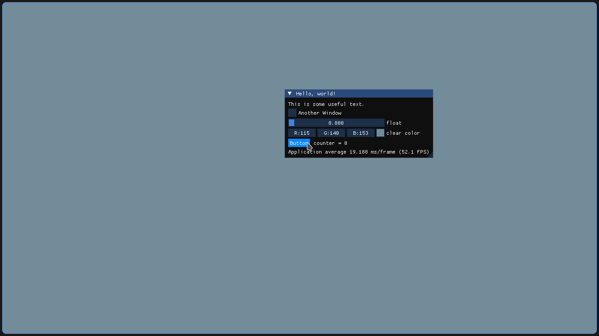
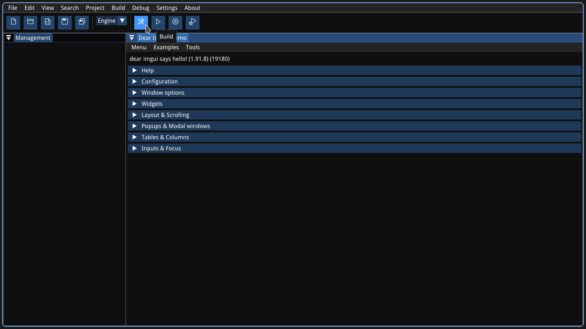

# BirdCPP
BirdCPP is a simple C/C++ IDE, it has basics feartures of a IDE, the idea of the IDE is to be a very simple replacement of Visual Studio for tiny projects.

## Planned features
- Code completion.
- Error/Warning/Hints in editor.
- Version control integration.
- Full CMake support.
  - Code completion.
  - Error/Warning/Hints in editor.
  - GUI editor for cmake files.
- Code search and code replacement.
- Code snippets.
- Code navigation (e.g. go to function implementation).
- Build/Run/"Build and run" from editor.

## Current features
- Nothing :)

## Building
BirdCPP uses cmake to generate the build files. Currently BirdCPP is in development in Linux, but probably can run in other operating systems.

### Linux
This is only a example build command instruction, you can modify.

```bash
mkdir build
cd build/
cmake -S ../ -B .
make
```

### After build
Move or copy the folder `resources/` of the BirdCPP root source directory to inside the build directory.

## Screenshots

### BirdCPP baby steps


### BirdCPP ui shapping

